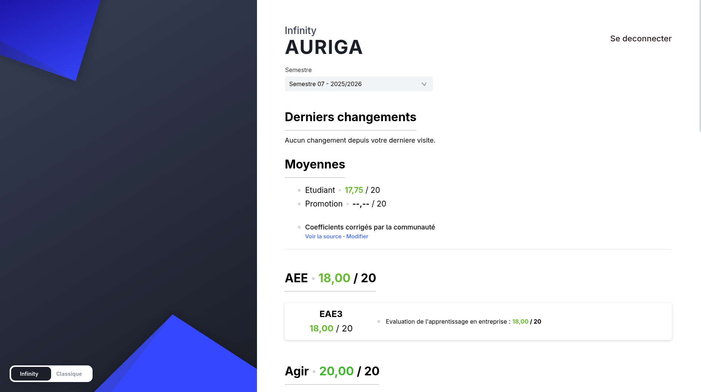

# Infinity Auriga

Enhanced grades UI for [Auriga](https://auriga.epita.fr) (EPITA).

Fork of [infinity-pegasus](https://github.com/Litarvan/infinity-pegasus) by the GOATed [Litarvan](https://github.com/Litarvan).



## Install

1. Install [Tampermonkey](https://www.tampermonkey.net/) (Chrome / Firefox / Edge)
2. **[Click here to install Infinity Auriga](https://raw.githubusercontent.com/KazeTachinuu/infinity-auriga/master/dist-userscript/infinity-auriga.user.js)**
3. Go to [auriga.epita.fr](https://auriga.epita.fr)

Auto-updates via Tampermonkey. Toggle between Infinity and classic Auriga with the switcher in the bottom-left.

## Features

- Clean grade display with module/subject hierarchy
- Weighted averages with community-contributed coefficients
- Change tracking — new/updated grades since your last visit
- Live loading screen
- One-click toggle to classic Auriga

## Coefficients

Auriga treats all exams as equally weighted. Infinity fixes this with community-contributed coefficient files.

The app shows whether corrected coefficients are active for your semester. If not, you can contribute them — see [`src/lib/coefficients/README.md`](src/lib/coefficients/README.md) for the full guide.

**Quick version:**

1. Create `src/lib/coefficients/s{semester}_{year}_{track}.js`
2. Export exam codes with their real coefficients
3. Open a PR — that's it, no other file to edit

## Development

```bash
bun install
bun run dev                # Dev server with mock API (localhost:5173)
bun run build:userscript   # Build Tampermonkey script → dist-userscript/
```

The dev server needs `tools/auriga-capture.json` for mock data. Use `tools/auriga-capture.user.js` (Tampermonkey) to capture your own from Auriga.

## License

[MIT](LICENSE)
