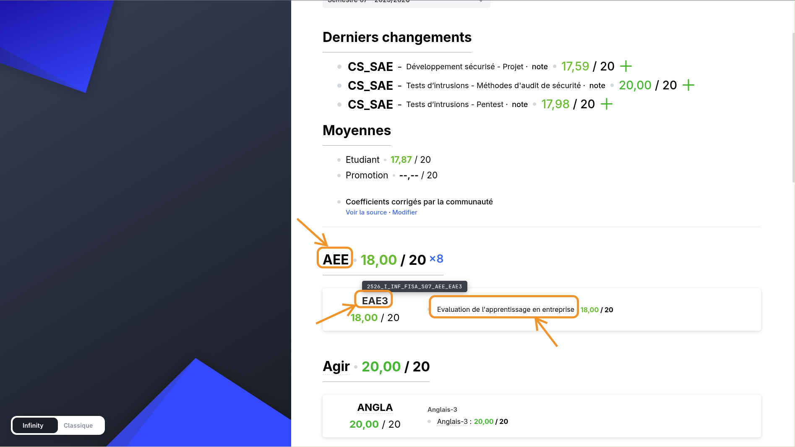

# Coefficients

Auriga treats all exams as equally weighted. This directory contains the **real** coefficients, contributed by the community.

## How to add coefficients for your semester

### 1. Find your codes

**Hover** any module name, subject name, or mark name in Infinity Auriga — a tooltip shows its full code. **Click** to copy it to your clipboard.

Every copyable name has a <u>dashed underline</u> to indicate it's clickable.



### Code anatomy

```
2526_I_INF_FISA_S07_CS_GR_WS_EX
│    │ │   │    │   │  │  │  └─ eval type (EX, PRJ, EXF, ...)
│    │ │   │    │   │  │  └──── exam
│    │ │   │    │   │  └─────── subject
│    │ │   │    │   └────────── module
│    │ │   │    └────────────── semester
│    │ │   └─────────────────── track (FISA, FISE, GISTRE, ...)
│    │ └─────────────────────── school
│    └───────────────────────── always I
└────────────────────────────── academic year (25/26)
```

### 2. Create a file

Filename: `s{semester}_{year}_{track}.js` (all lowercase)

| Semester | Year | Track | Filename |
|----------|------|-------|----------|
| S07 | 2025/2026 | FISA | `s07_2526_fisa.js` |
| S08 | 2025/2026 | FISE | `s08_2526_fise.js` |
| S09 | 2026/2027 | GISTRE | `s09_2627_gistre.js` |

### 3. Fill in your coefficients

You can override coefficients at **three levels** independently — module, subject, or individual mark. Use the appropriate code prefix:

```
Full code:   2526_I_INF_FISA_S07_CS_GR_WS_EX
                                 │   │  │  └─── mark level (full code)
                                 │   │  └────── subject level (trim exam + eval type)
                                 │   └───────── module level (first segment after semester)
```

Copy this template:

```js
/**
 * Coefficients — S?? TRACK YEAR
 *
 * Only list entries whose coefficient is NOT 1.
 * Override at any level:
 *   - Module:  'XXXX_I_INF_TRACK_SXX_MODULE'
 *   - Subject: 'XXXX_I_INF_TRACK_SXX_MODULE_SUBJECT'
 *   - Mark:    'XXXX_I_INF_TRACK_SXX_MODULE_SUBJECT_EXAM_TYPE'
 */
export default {
    // --- Module-level (weights the whole module in the student average) ---
    'XXXX_I_INF_TRACK_SXX_AEE': 8,

    // --- Subject-level (weights the subject in the module average) ---
    // 'XXXX_I_INF_TRACK_SXX_CS_GR': 2,

    // --- Mark-level (weights the mark in the subject average) ---
    'XXXX_I_INF_TRACK_SXX_CS_GR_WS_EX': 2,
};
```

See [`s07_2526_fisa.js`](s07_2526_fisa.js) for a real example.

### 4. Open a pull request

That's it. No other file to edit — coefficient files are auto-discovered at build time.
